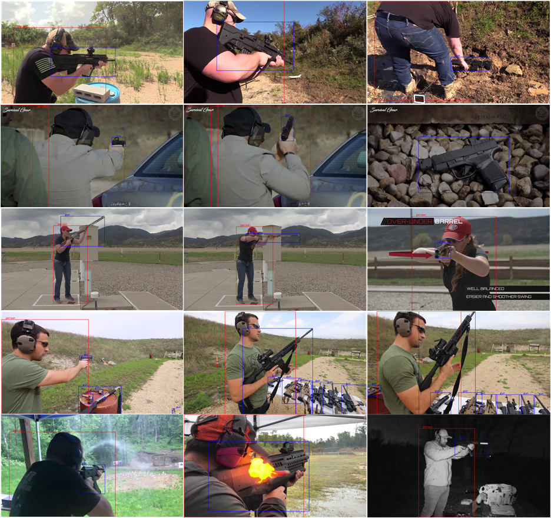

# YouTube-GDD: A challenging gun detection dataset with rich contextual information [[arXiv]](https://arxiv.org/pdf/2203.04129.pdf) [[Project Page]](https://www.researchgate.net/project/YouTube-GDD)

## Overview
To promote the development of security, this work presents a new challenging dataset called YouTube Gun Detection Dataset ([YouTube-GDD](https://arxiv.org/pdf/2203.04129.pdf)). Our dataset is collected from **343** high-definition YouTube videos and contains **5000** well-chosen images, in which **16064** instances of gun and **9046** instances of person are annotated. Compared to other datasets, YouTube-GDD is "dynamic", containing rich contextual information and recording shape changes of the gun during shooting. To build a baseline for gun detection, we evaluate [YOLOv5](https://github.com/ultralytics/yolov5) on YouTube-GDD and analyze the influence of additional related annotated information on gun detection.

<div align="center">
  
</div>
<br>

## Dates
- [x] Release Training and validation sets. [2022-04]
- [x] Release test images. [2022-04]
- [ ] Open the evaluation server to the public. [to be confirmed]
- [ ] Augment dataset volumn to the level of ten thousand. [to be confirmed]

## Description
1. All images are captured from [YouTube videos](https://www.youtube.com/results?search_query=gun).

2. All annotations are labeled in [YOLO](https://roboflow.com/formats/yolo-darknet-txt) format with [labelImg](https://github.com/tzutalin/labelImg).

3. YouTube-GDD contains two categories, namely **"person"** and **"gun"**, corresponding to category ids **0** and **1**, respectively.

4. The name format of each image file and the corresponding label file is set as **"YouTube id_original frame rate_split frame rate_ID"**.

## Statistics
Firstly, we split the entire dataset into 10 nonoverlapping folds by [filename](https://github.com/UCAS-GYX/YouTube-GDD/blob/main/configs/imagelist_10flod.npy), each containing 500 images. Secondly, we compute the ratio of different scales in the entire dataset as the probability distribution, and then compute the scale distribution of each fold. The two folds with the lowest **JS divergence** are chosen as test set and validation set, i.e., **fold7** is chosen as the **test set** and **fold6** is chosen as the **validation set** while the rest folds are adopted as the training set.

<table>
   <tr>
      <th rowspan="2" valign="center">Split</th>
      <th rowspan="2" valign="center">Images</th>
      <th rowspan="2" valign="center">Videos</th>
      <th colspan="2" align="center">Category</th>
      <th colspan="3" aligin="center">Scale</th>
   </tr>
   <tr>
      <th align="center">person</th>
      <th align="center">gun</th>
      <th align="center">small</th>
      <th align="center">medium</th>
      <th align="center">large</th>
   </tr>
   <tr>
      <th align="center">fold1</th>
      <td align="center">500</td>
      <td align="center">35</td>
      <td align="center">467</td>
      <td align="center">1265</td>
      <td align="center">373</td>
      <td align="center">235</td>
      <td align="center">1124</td>
   </tr>
   <tr>
      <th align="center">fold2</th>
      <td align="center">500</td>
      <td align="center">34</td>
      <td align="center">430</td>
      <td align="center">620</td>
      <td align="center">4</td>
      <td align="center">84</td>
      <td align="center">962</td>
   </tr>
   <tr>
      <th align="center">fold3</th>
      <td align="center">500</td>
      <td align="center">31</td>
      <td align="center">466</td>
      <td align="center">905</td>
      <td align="center">39</td>
      <td align="center">259</td>
      <td align="center">1073</td>
   </tr>
   <tr>
      <th align="center">fold4</th>
      <td align="center">500</td>
      <td align="center">31</td>
      <td align="center">427</td>
      <td align="center">751</td>
      <td align="center">5</td>
      <td align="center">124</td>
      <td align="center">1049</td>
   </tr>
   <tr>
      <th align="center">fold5</th>
      <td align="center">500</td>
      <td align="center">36</td>
      <td align="center">471</td>
      <td align="center">716</td>
      <td align="center">11</td>
      <td align="center">120</td>
      <td align="center">1056</td>
   </tr>
   <tr>
      <th align="center">fold6</th>
      <td align="center">500</td>
      <td align="center">43</td>
      <td align="center">415</td>
      <td align="center">718</td>
      <td align="center">13</td>
      <td align="center">122</td>
      <td align="center">998</td>
   </tr>
   <tr>
      <th align="center">fold7</th>
      <td align="center">500</td>
      <td align="center">42</td>
      <td align="center">394</td>
      <td align="center">879</td>
      <td align="center">67</td>
      <td align="center">193</td>
      <td align="center">1013</td>
   </tr>
   <tr>
      <th align="center">fold8</th>
      <td align="center">500</td>
      <td align="center">34</td>
      <td align="center">475</td>
      <td align="center">636</td>
      <td align="center">1</td>
      <td align="center">60</td>
      <td align="center">1050</td>
   </tr>
   <tr>
      <th align="center">fold9</th>
      <td align="center">500</td>
      <td align="center">33</td>
      <td align="center">460</td>
      <td align="center">589</td>
      <td align="center">3</td>
      <td align="center">57</td>
      <td align="center">989</td>
   </tr>
   <tr>
      <th align="center">fold10</th>
      <td align="center">500</td>
      <td align="center">32</td>
      <td align="center">518</td>
      <td align="center">953</td>
      <td align="center">37</td>
      <td align="center">281</td>
      <td align="center">1151</td>
   </tr>
   <tr>
      <th align="center">all</th>
      <td align="center">5000</td>
      <td align="center">343</td>
      <td align="center">9046</td>
      <td align="center">16064</td>
      <td align="center">1106</td>
      <td align="center">3070</td>
      <td align="center">20934</td>
   </tr>
</table>

**Table Note:** Frames captured from the same video may be assigned into two adjacent folds, causing the video to be repeatedly counted.

## Construct YouTube-GDD from Source Videos
**[Update 18th April]** We thank [a2515919](https://github.com/a2515919) who is also working on the dataset and willing to share the pre-processed images: [Google Drive Link](https://drive.google.com/file/d/1TH6kSx7WoFRrUPbxcDGYBrFrYUI1ReWa/view).

Here, three scripts are provided for constructing YouTube-GDD from source videos step by step.

+ Download videos.
```bash
cd /path/to/YouTube-GDD/
python ./tools/download.py --videolist ./configs/videolist.txt  --videopath /path/to/videos
```
+ Extract frames.
```bash
cd /path/to/YouTube-GDD/
python ./tools/extract.py  --videopath /path/to/videos  --framepath /path/to/frames
```
+ Select images.
```bash
cd /path/to/YouTube-GDD/
python ./tools/select.py  --imagelist  ./configs/imagelist.npy  --framepath /path/to/frames --imagepath /path/to/images
```

After collecting images, unzip [labels.zip](https://github.com/UCAS-GYX/YouTube-GDD/blob/main/labels.zip) to the parent root of imagepath and **the expected dataset structure** should be organized as follows, which also meets the dataset structure requirement of [YOLOv5](https://github.com/ultralytics/yolov5).
```
YouTube-GDD/
  images/
      train/
      val/
      test/
  labels/
      train/
      val/
```

## Baseline
<table>
   <tr>
      <th rowspan="2" valign="center">Method</th>
      <th rowspan="2" valign="center">w/ TL</th>
      <th rowspan="2" valign="center">w/ AoP</th>
      <th rowspan="2" align="center">FLOPs</th>
      <th rowspan="2" aligin="center">Params</th>
      <th colspan="2" aligin="center">Gun</th>
      <th colspan="2" aligin="center">Person</th>
   </tr>
   <tr>
      <th align="center">AP<sub>50</sub></th>
      <th align="center">AP</th>
      <th align="center">AP<sub>50</sub></th>
      <th align="center">AP</th>
   </tr>
<tr>
        <th rowspan="4" valign="center"><a href=https://github.com/ultralytics/yolov5/blob/master/models/yolov5s.yaml>YOLOv5s</a></th>
        <td align="center"></td>
        <td align="center"></td>
        <td align="center">15.80G</td>
        <td align="center">7.01M</td>
        <td align="center">67.7</td>
        <td align="center">41.0</td>
        <td align="center">-</td>
        <td align="center">-</td>
    </tr>
    <tr>
        <td align="center"></td>
        <td align="center">yes</td>
        <td align="center">15.81G</td>
        <td align="center">7.02M</td>
        <td align="center">67.9</td>
        <td align="center">41.3</td>
        <td align="center">90.3</td>
        <td align="center">75.0</td>
    </tr>
    <tr>
        <td align="center">yes</td>
        <td align="center"></td>
        <td align="center">15.80G</td>
        <td align="center">7.01M</td>
        <td align="center">75.0</td>
        <td align="center">52.0</td>
        <td align="center">-</td>
        <td align="center">-</td>
    </tr>
    <tr>
        <td align="center">yes</td>
        <td align="center">yes</td>
        <td align="center">15.81G</td>
        <td align="center">7.02M</td>
        <td align="center">77.3</td>
        <td align="center">52.1</td>
        <td align="center">92.4</td>
        <td align="center">81.2</td>
    </tr>
</table>

**Table Note:** TL means Transfer Learning and AoP means Annotations of Person.

## Contact
If you have any general question, feel free to email us at `guyongxiang19@mails.ucas.ac.cn`. If you have dataset-related or implementation-related questions, please feel free to send emails to us or open an issue in this codebase (We recommend that you open an issue in this codebase, because your questions may help others). 

## Citation
If you find our work inspiring or use our dataset in your research, please cite our work.
```
@article{gu2022youtube-gdd,
  title={YouTube-GDD: A challenging gun detection dataset with rich contextual information},
  author={Gu Yongxiang and Liao Xingbin and Qin Xiaolin},
  journal={arXiv preprint arXiv:2203.04129},
  year={2022}
}
```

## Thanks
We thank Lab students, namely Mingfei Li, Jingyang Shan, Qianlei Wang, Siqi Zhang, Xu Liao, Yuncong Peng, Gang Luo, Xin Lan, Boyi Fu and Yangge Qian, for their suggestions about improving the YouTube-GDD dataset.
